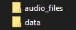
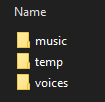
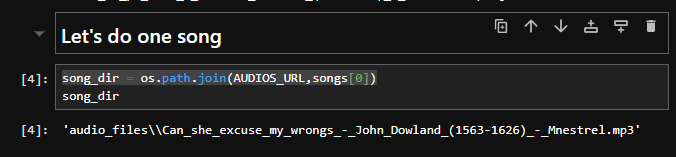

# Separate-voice-from-music

This algorithm uses the module [spleeter](https://github.com/deezer/spleeter).
Some times installing it is a pain, not as much as installing tensorflow, but close.
So here it is a robust step by step installation:

You need a fresh new anaconda env with just python 3.7:

``` conda create --name new_env python==3.7 ```

Then install spleeter with conda:

``` conda install -c conda-forge spleeter ```

You can use spleeter-gpu if you can and want, but it's not necessary, it's obviously faster, but the result is equally good:

``` conda install -c conda-forge spleeter-gpu ```

Next you'll need to create two folder, one called audio_files and other called data:



Inside data you'll need to create three more called: music, temp and voices:



Then you can test the process and installation by going step by step trought the pipeline in the notebook: test_app.ipynb:



Lastly: first time you run it spleeter is going to download a pretrain model, don't get scared.

That's all.

Jonathan Marín
marinlafare@gmail.com